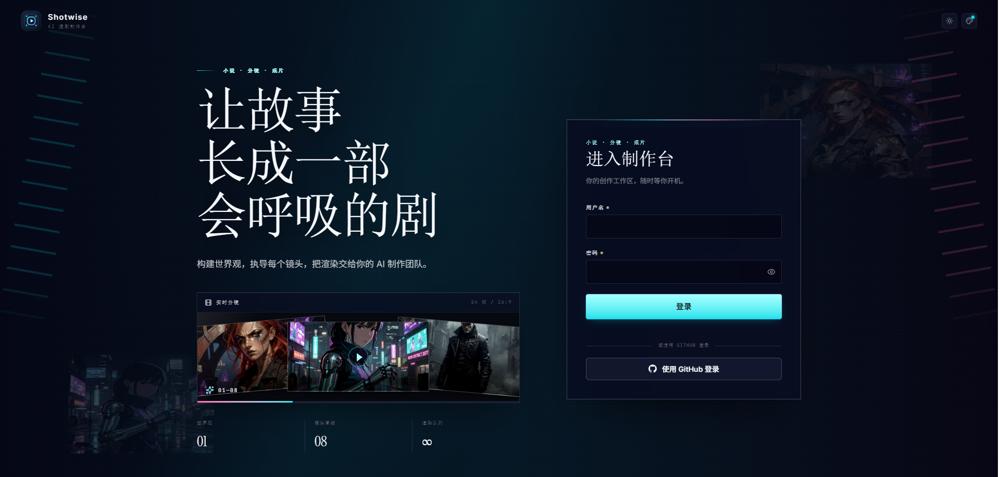
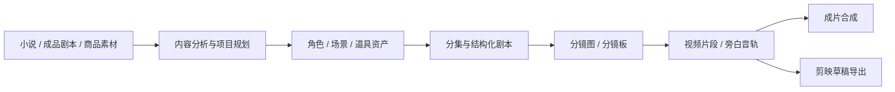
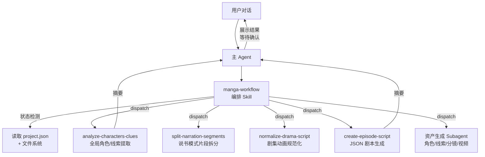
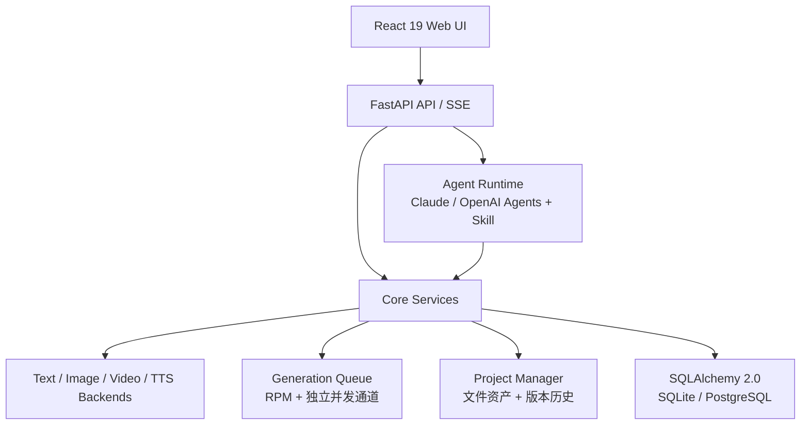

<h1 align="center">
  <br>
  <picture>
    <source media="(prefers-color-scheme: light)" srcset="frontend/public/shotwise-mark.svg">
    <source media="(prefers-color-scheme: dark)" srcset="frontend/public/shotwise-mark.svg">
    
  </picture>
  <br>
  SHOTWISE
  <br>
</h1>

<p align="center">
  <strong>开源、自托管的 AI 视频生产工作台</strong>
  <br>
  将小说、成品剧本或商品素材转化为角色一致、过程可控、成本可追踪、可继续编辑的短视频。
</p>

<p align="center">
  <a href="README.md"></a>
  <a href="README.en.md"></a>
</p>

<p align="center">
  <a href="#快速开始"></a>
  <a href="https://github.com/ghc4412/Shotwise/blob/main/LICENSE"></a>
  <a href="https://github.com/ghc4412/Shotwise"></a>
  <a href="https://github.com/ghc4412/Shotwise/pkgs/container/SHOTWISE"></a>
  <a href="https://github.com/ghc4412/Shotwise/actions/workflows/test.yml"></a>
  <a href="https://codecov.io/gh/ghc4412/Shotwise"></a>
  <a href="https://github.com/ghc4412/Shotwise/security/code-scanning"></a>
  <a href="https://github.com/ghc4412/Shotwise/releases/latest"></a>
</p>

<p align="center">
  <a href="#快速开始"><strong>快速开始</strong></a>
  ·
  <a href="docs/getting-started.md">入门教程</a>
  ·
  <a href="docs/README.md">完整文档</a>
</p>

<p align="center">
  
</p>

> Shotwise 不是一个简单的“提示词套壳”。它把内容分析、剧本结构化、角色与场景资产、分镜生成、视频任务、费用统计、版本回滚和成片导出组织成一条可审核、可中断恢复的生产流水线。

## 界面与主题

Shotwise 提供面向生产工作的工作台界面：项目大厅、项目工作台和登录页使用统一的顶部导航、信息层级和品牌图标。右上角的太阳/月亮按钮可以在日间和夜间模式之间切换，选择会保存在当前浏览器中，刷新后仍然生效。

项目大厅支持按制作阶段筛选、关键词搜索，并可按最近活动、进行中、完成度或创建时间排序；筛选、搜索和排序会写入 URL，刷新、返回或分享链接时可以恢复当前视图。问候语按本地时间更新，页面切换到后台时暂停刷新。

## 核心能力

<table>
<tr>
<td width="33%" valign="top">

### 🎭 AI 漫剧与小说改编

从长篇小说或成品剧本提取角色、场景和剧情结构，分集制作角色一致的剧集动画。

</td>
<td width="33%" valign="top">

### 🎙️ 说书与旁白短视频

按朗读节奏拆分内容，生成分镜、旁白音轨和竖屏视频，并导出可继续编辑的剪映草稿。

</td>
<td width="33%" valign="top">

### 🛍️ 广告与带货短片

上传商品多图，建立产品参考资产，按目标时长生成带货镜头脚本和产品锚定画面。

</td>
</tr>
</table>

## 从输入到成片



每个阶段都可以由 AI 助手编排，也可以由用户在工作台中审核、调整或重新生成。详细模式选择见 [创作流程与模式](docs/workflows.md)。

## 快速开始

### 准备工作

- Docker 和 Docker Compose
- 建议从 2 GB 可用内存起步
- 完整创作流程需要：
  - 一组用于 Shotwise AI 助手的模型凭据
  - 可用的文本、图像和视频生成能力（可以由一家全模态供应商提供，也可以组合多家供应商）
  - 按需配置的 TTS 能力
- 默认使用远程模型 API，通常不要求本机 GPU；接入本地模型时，资源要求由对应服务决定

### 默认部署：SQLite

```bash
git clone https://github.com/ghc4412/Shotwise.git
cd SHOTWISE/deploy
cp .env.example .env
docker compose up -d
```

检查服务状态：

```bash
cd SHOTWISE/deploy/production
cp .env.example .env    # 需设置 POSTGRES_PASSWORD
docker compose up -d
```

部署、升级、备份和反向代理见 [部署与运维](docs/deployment.md)；支持边界和漏洞报告方式见 [安全政策](SECURITY.md)。

1. **SHOTWISE 智能体** — 配置驱动 AI 助手的供应商凭据，支持 Anthropic 官方及多种兼容供应商，自定义 Base URL 与模型
2. **AI 生图/生视频/生文本** — 配置至少一个供应商的 API Key（Gemini / 火山方舟 / Grok / OpenAI / Vidu / 阿里百炼 / MiniMax / 可灵），或添加自定义供应商

### 🤖 Agent 驱动的可恢复工作流

AI 助手支持 Claude Agent SDK 与 OpenAI Agents SDK，均复用编排 Skill + 聚焦 Subagent 架构；可在 Agent 配置中为凭据选择对应 SDK 通道。主 Agent 识别项目所处阶段，把角色提取、分集规划、剧本规范化和资产生成分发给对应 Subagent，并只接收精炼结果。

### 🎨 角色、场景与道具资产

角色设计图、风格参考图以及场景和道具资产作为跨镜头参考源，减少人物外观、场景氛围和关键物品在不同镜头中的漂移。

资产名称可以直接编辑，重命名会级联更新项目内引用。

### 🎬 三种视频制作方式

- **分镜图生视频**：以单张分镜图驱动视频生成，适合逐镜审核和调整。
- **分镜板生视频**：先在一张分镜板（宫格）中统一生成多个镜头，再切分为单镜头分镜图生成视频，适合多镜头一致性要求较高的场景。
- **参考生视频**：直接引用角色、场景和道具资产，跳过普通分镜步骤。

### ⚡ 异步任务与并发控制

图像、视频和音频任务拥有独立并发通道；支持 RPM 限速、任务状态跟踪、失败恢复和中断后的继续执行。

### 🕰️ 版本历史与项目归档

重新生成会保留历史版本；项目可整体导入和导出，便于备份、迁移以及不同环境之间交接。导入 ZIP 前会先在临时目录执行预检，检查归档结构、可修复问题和警告，并在写入前提示项目名冲突；预检不会安装或修改目标项目。

### 💰 费用预估与实际用量

按供应商和媒体类型统计调用量，区分币种，并提供项目、剧集和镜头级的预估与实际费用对比。

### 🎙️ 旁白与后期导出

支持旁白 TTS、逐段试听和批量生成；剪映草稿导出可保留视频片段、旁白音轨和字幕轨，方便继续后期处理。

### 🔌 外部 Agent 集成

Shotwise 可以签发 `shotwise-` 前缀 API Key，并通过同步 Agent 对话端点供 OpenClaw 等外部 Agent 平台调用。

## 供应商支持

SHOTWISE 通过统一的 `ImageBackend` / `VideoBackend` / `TextBackend` 协议，支持多个预置供应商和自定义供应商，可在全局或项目级别切换：

| 供应商 | 文本 | 图像 | 视频 | TTS |
|---|:---:|:---:|:---:|:---:|
| Gemini | ✅ | ✅ | ✅ | — |
| 火山方舟 | ✅ | ✅ | ✅ | — |
| Grok | ✅ | ✅ | ✅ | — |
| OpenAI | ✅ | ✅ | ✅ | — |
| Vidu | — | ✅ | ✅ | — |
| 阿里百炼 | ✅ | ✅ | ✅ | ✅ |
| MiniMax | ✅ | ✅ | ✅ | — |
| 可灵 Kling | — | ✅ | ✅ | — |
| Agnes | ✅ | ✅ | ✅ | — |
| 自定义供应商 | 取决于接口 | 取决于接口 | 取决于接口 | 取决于接口 |

| 供应商 | 可用模型 | 能力 | 计费方式 |
|--------|----------|------|----------|
| **Gemini** (Google) | Nano Banana 2, Nano Banana Pro | 文生图、图生图（多参考图） | 按分辨率查表 (USD) |
| **火山方舟** | Seedream 5.0, Seedream 5.0 Lite, Seedream 4.5, Seedream 4.0 | 文生图、图生图 | 按张计费 (CNY) |
| **Grok** (xAI) | Grok Imagine Image, Grok Imagine Image Pro | 文生图、图生图 | 按张计费 (USD) |
| **OpenAI** | GPT Image 2 | 文生图、图生图（多参考图） | 按 token 用量 (USD) |
| **Vidu** (生数科技) | Vidu Q2 Image, Vidu Q1 Image | 文生图、图生图 | 按积分折算 (CNY) |
| **阿里百炼** (DashScope) | Qwen Image 2.0 / Pro, Qwen Image Edit Plus / Max, 万相 2.7 图像 / Pro | 文生图、图生图 | — |
| **MiniMax** | MiniMax Image 01 | 文生图、图生图（单脸参考立绘） | — |
| **可灵 Kling** (快手) | 可灵图像 O1, 可灵 V3-Omni 图像 | 文生图、图生图 | — |

### 视频供应商

| 供应商 | 可用模型 | 能力 | 时长 (秒) | 计费方式 |
|--------|----------|------|-----------|----------|
| **Gemini** (Google) | Veo 3.1, Veo 3.1 Fast, Veo 3.1 Lite | 文生视频、图生视频、视频延展、负面提示词 | 4 / 6 / 8 | 按分辨率 × 时长查表 (USD) |
| **火山方舟** | Seedance 2.0, Seedance 2.0 Fast, Seedance 1.5 Pro | 文生视频、图生视频、视频延展、音频生成、种子控制、离线推理 | 4–15 | 按 token 用量 (CNY) |
| **Grok** (xAI) | Grok Imagine Video | 文生视频、图生视频 | 1–15 | 按秒计费 (USD) |
| **OpenAI** | Sora 2, Sora 2 Pro | 文生视频、图生视频 | 4 / 8 / 12 | 按秒计费 (USD) |
| **Vidu** (生数科技) | Vidu Q3 Turbo, Vidu Q3 Pro, Vidu Q3 (Reference), Vidu 2.0 | 文生视频、图生视频、参考生视频、音频生成、种子控制 | 1–16（参考生视频 3–16；2.0: 4 / 8） | 按积分折算 (CNY) |
| **阿里百炼** (DashScope) | HappyHorse 1.0（图/文/参考生视频）, 万相 2.7（图/文/参考生视频） | 文生视频、图生视频、参考生视频、音频生成、种子控制 | 2–15 | — |
| **MiniMax** | MiniMax Hailuo 2.3 / 2.3 Fast, MiniMax S2V-01 | 文生视频、图生视频、单脸参考生视频 | 6 / 10（S2V-01: 6） | — |
| **可灵 Kling** (快手) | 可灵 2.5 Turbo, 可灵 v3, 可灵 v3 Omni, 可灵 v2.6, 可灵 Video O1 | 文生视频、图生视频、参考生视频、音频生成 | 5 / 10（v3 · Omni: 3–15） | — |

### 文本供应商

| 供应商 | 可用模型 | 能力 | 计费方式 |
|--------|----------|------|----------|
| **Gemini** (Google) | Gemini 3.1 Pro, Gemini 3 Flash, Gemini 3.1 Flash Lite | 文本生成、结构化输出、视觉理解 | 按 token 用量 (USD) |
| **火山方舟** | 豆包 Seed 2.0 Pro / Lite / Mini, 豆包 Seed 1.8 | 文本生成、结构化输出、视觉理解 | 按 token 用量 (CNY) |
| **Grok** (xAI) | Grok 4.20 Reasoning / Non-Reasoning, Grok 4.1 Fast Reasoning / Non-Reasoning | 文本生成、结构化输出、视觉理解 | 按 token 用量 (USD) |
| **OpenAI** | GPT-5.5, GPT-5.4, GPT-5.4 Mini, GPT-5.4 Nano | 文本生成、结构化输出、视觉理解 | 按 token 用量 (USD) |
| **阿里百炼** (DashScope) | Qwen Plus, Qwen3.6 Plus / Flash, Qwen3 Max, Qwen3.7 Max, Qwen Long | 文本生成、结构化输出 | — |
| **MiniMax** | MiniMax M3, MiniMax M2.7 | 文本生成、结构化输出 | — |

### 自定义供应商

除预置供应商外，可接入任何 **OpenAI 兼容** 或 **Google 兼容** API：

- 在设置页添加自定义供应商，填入 Base URL 和 API Key
- 自动调用 `/v1/models` 发现可用模型，按名称推断媒体类型（图片/视频/文本）
- 与预置供应商享有同等功能：全局/项目级切换、费用追踪、版本管理

供应商选择优先级：项目级设置 > 全局默认。切换供应商时通用设置（分辨率、宽高比、音频等）直接沿用，供应商特有参数保留。

## AI 助手架构

SHOTWISE 的 AI 助手支持 Claude Agent SDK 与 OpenAI Agents SDK，采用**编排 Skill + 聚焦 Subagent** 的多智能体架构：



**核心设计原则**：

- **编排 Skill（manga-workflow）** — 具备状态检测能力，自动判断项目当前阶段（角色设计 / 分集规划 / 预处理 / 剧本生成 / 资产生成），dispatch 对应的 Subagent，支持从任意阶段进入和中断恢复
- **聚焦 Subagent** — 每个 Subagent 只完成一项任务后返回，小说原文等大量上下文留在 Subagent 内部，主 Agent 只收到精炼摘要，保护上下文空间
- **Skill vs Subagent 边界** — Skill 负责确定性脚本执行（API 调用、文件生成），Subagent 负责需要推理分析的任务（角色提取、剧本规范化）
- **阶段间确认** — 每个 Subagent 返回后，主 Agent 向用户展示结果摘要并等待确认，确认后才进入下一阶段

## OpenClaw 集成

SHOTWISE 支持通过 [OpenClaw](https://openclaw.ai) 和 Codex 等外部 AI Agent 平台调用，实现自然语言驱动的视频创作：

1. 在 SHOTWISE 设置页生成 API Key（`shotwise-` 前缀）
2. 在 OpenClaw 中加载 SHOTWISE 的 Skill 定义（访问 `http://your-domain/skill.md` 自动获取）
3. 通过 OpenClaw 对话即可创建项目、生成剧本、制作视频

技术实现：API Key 认证（Bearer Token）+ 同步 Agent 对话端点（`POST /api/v1/agent/chat`），内部对接 SSE 流式助手并收集完整响应返回。

## 技术架构



技术栈包括 React 19、TypeScript、FastAPI、Python 3.12+、Claude Agent SDK、OpenAI Agents SDK、SQLAlchemy 2.0、FFmpeg、Docker 和 Docker Compose。架构边界与扩展方式见 [架构说明](docs/architecture.md)。

## 使用前需要了解的边界

- 媒体生成依赖第三方模型服务，生成速度、可用性、内容策略和成本受供应商影响。
- 长篇内容仍需要人工审核分集、角色资产和关键剧情节点，Shotwise 的目标是增强创作者，而不是完全取消审核。
- 不同视频模型对参考图数量、视频时长、首尾帧、音频和地区可用性的支持不同。
- Windows 原生环境可以运行部分基础流程，但 Agent 沙箱等 POSIX 能力会降级；优先使用 Linux、macOS、WSL2 或 Docker。
- 生产环境应使用 PostgreSQL、HTTPS、强密码和定期备份，不建议直接把未加保护的 `1241` 端口暴露到公网。

更多问题见 [常见问题](docs/FAQ.md)。

## 文档

| 文档 | 内容 |
|---|---|
| [文档导航](docs/README.md) | 按使用者、运维者和开发者整理的文档入口 |
| [完整入门教程](docs/getting-started.md) | 从首次部署到生成第一条视频 |
| [创作流程与模式](docs/workflows.md) | 小说、剧本、广告模式以及三种视频制作方式 |
| [供应商与模型配置](docs/providers.md) | Agent、文本、图像、视频、TTS 供应商的选择和配置 |
| [部署与运维](docs/deployment.md) | SQLite、PostgreSQL、升级、备份、反向代理 |
| [安全政策](SECURITY.md) | 支持版本、部署边界、私密漏洞报告和协调披露 |
| [安全威胁模型](docs/security/threat-model.md) | 安全资产、信任边界、攻击面和重评触发条件 |
| [剪映草稿导出](docs/jianying-export-guide.md) | 将 Shotwise 生成结果交给剪映继续编辑 |
| [架构说明](docs/architecture.md) | Agent Runtime、任务队列、供应商抽象和数据层 |
| [常见问题](docs/FAQ.md) | 部署、费用、模型、数据和许可证问题 |
| [贡献指南](CONTRIBUTING.md) | 本地开发、测试、代码规范和 PR 流程 |
| [更新记录](CHANGELOG.md) | 每个版本的功能和修复 |

## 贡献

欢迎贡献代码、文档、测试、供应商适配和问题复现。

开始开发前请阅读 [CONTRIBUTING.md](CONTRIBUTING.md)。本地克隆后建议立即安装项目的 pre-commit 钩子：

```bash
uv run pre-commit install
```

---

<p align="center">
  如果觉得项目有用，请给个 ⭐ Star 支持一下！
</p>
