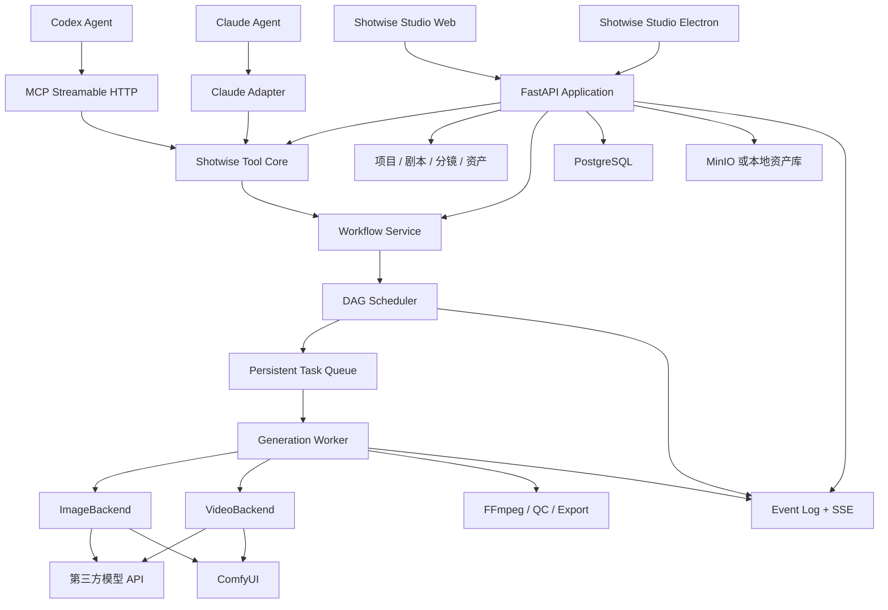

# 逐镜 Shotwise：AI 漫剧生产平台架构方案 v6

> 版本：v6.0
> 日期：2026-08-07
> 部署：Docker Compose 私有化工作室
> 策略：第三方 API 优先，本地 GPU 可选

## 1. 产品定义

### 1.1 品牌

| 项目 | 名称 |
|---|---|
| 中文品牌 | 逐镜 |
| 英文品牌 | Shotwise |
| 中文全称 | 逐镜 AI 漫剧生产平台 |
| 英文全称 | Shotwise AI Production Studio |
| 桌面程序 | `Shotwise Studio.exe` |

模块命名：

| 模块 | 职责 |
|---|---|
| Shotwise Studio | Web 与 Electron 创作工作台 |
| Shotwise Flow | 生产 DAG、进度、审批和失败定位 |
| Shotwise Agent | Codex、Claude 和 MCP 接入 |
| Shotwise Render | 第三方 API 与 ComfyUI Backend |
| Shotwise Assets | 剧本、角色、场景、分镜和成片资产 |
| Shotwise Console | 模型、模板、费用、权限和运维 |

### 1.2 目标

用户通过自然语言下达任务，系统完成：

```text
需求理解
  -> 剧本版本
  -> 角色与场景设定
  -> 分镜 DAG
  -> 批量图片和视频渲染
  -> 配音与字幕
  -> 合成与质检
  -> 成片导出
```

用户可以自动执行、手动逐节点执行，或在关键节点审批后继续。

### 1.3 首版边界

首版采用模块化单体，不引入独立重型渲染网关、Temporal、NATS 或 Kubernetes。业务状态保存在平台数据库；渲染引擎和第三方 API 只负责执行生成任务。

第三方 API 模式会把指定素材发送到外部供应商，不能宣传为“数据完全不出本地”。本地-only 项目只允许使用本地 Backend。

所有第三方源代码、模型、节点、字体和媒体资产必须进入许可证清单与 SBOM。产品改名不改变第三方许可证义务。

## 2. 总体架构



### 2.1 组件职责

| 组件 | 负责 | 不负责 |
|---|---|---|
| Studio | 编辑、预览、审批、监控 | 保存权威任务状态 |
| API | 认证、业务 API、SSE、MCP | 阻塞等待长任务 |
| Tool Core | 参数、权限、预算、幂等 | 绑定单一 Agent SDK |
| Scheduler | DAG 依赖、状态和重试 | 调用供应商细节 |
| Worker | 执行单个 task | 修改 DAG 结构 |
| Backend | 提交、轮询、取消、收集 | 修改剧本和业务状态 |
| ComfyUI | 执行版本化渲染模板 | 保存业务真相 |
| Database | 状态、版本、事件和审计 | 保存媒体二进制 |
| Asset Store | 保存媒体和模板归档 | 判断任务成功 |

### 2.2 四层真相源

```text
Production DAG       业务依赖
Node Run Item        批量镜头实例
Task                 本地执行尝试
External Execution   第三方提交和付费副作用
```

四层不可合并。一个业务节点可有多个 item，一个 item 可有多次 task attempt，一个 task attempt 最多有一个有效 external execution。

## 3. 工作流设计

### 3.1 业务 DAG

推荐节点：

```text
source_import
  -> script_generate
  -> script_review
  -> character_reference
  -> storyboard_generate
  -> storyboard_review
  -> shot_image_generate
  -> shot_video_generate
  -> voice_generate
  -> subtitle_generate
  -> compose
  -> quality_check
  -> export
```

业务 DAG 只展示业务步骤。采样器、ControlNet、IPAdapter 等渲染节点保留在渲染模板中，不进入业务画布。

### 3.2 执行模式

| 模式 | 行为 |
|---|---|
| auto | Agent 生成计划，低风险节点自动推进 |
| manual | 用户逐节点配置和启动 |
| hybrid | Agent 规划，剧本、角色、关键分镜和成片需要审批 |

默认采用 hybrid。

拖动节点位置只修改布局。修改提示词、素材、模型、模板或参数必须创建新 revision，并将受影响的下游标记为 `stale`。运行中的 graph snapshot 不允许被编辑。

### 3.3 发布校验

工作流 revision 发布前必须验证：

- 无环、自环、悬空边和不可达节点。
- 节点类型和 schema 版本可用。
- 输入输出引用完整。
- 条件表达式来自白名单。
- fan-out、预算和并发不超过限制。
- Backend 能力满足节点要求。
- 需要的模型和模板已经发布。

## 4. 数据模型

### 4.1 工作流定义

#### `workflow_definitions`

```text
id
workspace_id
project_id
name
scope
active_revision_id
created_by
created_at/updated_at
```

#### `workflow_revisions`

```text
id
definition_id
revision_no
status                 # draft/published/deprecated
graph_hash             # 包含布局
execution_hash         # 只包含执行语义
template_lock_json
created_by/created_at
```

发布后的 revision 不可修改。

#### `workflow_nodes`

```text
revision_id
node_key
node_type
node_type_version
config_schema_version
config_json
ui_position_json
weight
retry_policy_json
approval_policy_json
PRIMARY KEY(revision_id, node_key)
```

#### `workflow_edges`

```text
revision_id
edge_key
source_node_key
target_node_key
condition_json
on_failure             # stop/skip/fallback
priority
```

### 4.2 工作流运行

#### `workflow_runs`

```text
id
workflow_revision_id
workspace_id/project_id
script_revision_id
status
mode
execution_hash
graph_snapshot_ref
input_snapshot_json
progress
version
control_generation
trace_id
created_by
created_at/started_at/finished_at
```

#### `workflow_node_runs`

```text
id
workflow_run_id
node_key
attempt_no
status
input_hash
input_snapshot_json
progress
progress_source
phase_code/phase_params_json
error_code/error_params_json
output_refs_json
lease_owner/lease_until
fencing_token
created_at/updated_at
UNIQUE(workflow_run_id, node_key, attempt_no)
```

#### `workflow_node_run_items`

```text
id
node_run_id
item_key               # episode/scene/shot
ordinal
input_hash
input_snapshot_json
weight
status
current_attempt_no
lineage_hash
output_refs_json
error_code/error_params_json
UNIQUE(node_run_id, item_key)
```

fan-out 在节点排队前物化为 items。运行中不得隐式增加 item。

### 4.3 执行记录

#### `tasks`

```text
id
workflow_run_id
workflow_node_run_id
node_run_item_id
attempt_no
task_type/media_type
status
input_fingerprint
request_idempotency_key
progress/progress_source
phase_code
lease_owner/lease_until
fencing_token
created_at/updated_at/finished_at
```

#### `external_executions`

```text
id
task_id
provider_id/provider_account_id
endpoint_snapshot/model_snapshot
provider_job_id
provider_idempotency_key
submit_state
remote_state/cancel_state
request_hash/response_digest
fencing_token
submitted_at/last_polled_at/finished_at
```

#### `workflow_approvals`

```text
id
workflow_run_id/node_run_id
action
execution_hash/input_hash
budget_limit
status
requested_by/decided_by
expires_at/decided_at
```

审批绑定具体输入和预算。输入、模型、供应商或 fan-out 改变后，旧审批失效。

#### `budget_reservations`

```text
id
workspace_id
workflow_run_id/node_run_id
currency
estimated_amount
reserved_amount
settled_amount
price_catalog_version
status/expires_at
```

### 4.4 资产和事件

#### `asset_versions`

```text
id/workspace_id/asset_id/version
content_sha256/source_sha256
storage_key/status
media_probe_json
lineage_hash
origin_task_id
origin_external_execution_id
retention_class
quarantine_reason
```

#### `project_event_log`

```text
seq                    # 全局传输顺序
event_id
workspace_id/project_id
aggregate_type/aggregate_id
aggregate_version      # 单实体状态顺序
event_type/event_version
payload_json
causation_id/correlation_id
actor_type/actor_id
trace_id/created_at
```

## 5. 状态机和调度

### 5.1 Run 状态

```text
planned -> running
running -> paused/waiting_review/succeeded/failed/cancelled
paused -> running/cancelled
waiting_review -> running/cancelled
```

终态不可回退。

### 5.2 Node 状态

```text
blocked -> ready -> queued -> running -> collecting -> succeeded
                            |             |
                            v             v
                        retry_wait      failed
                            |
                            v
                          ready
```

附加状态：`waiting_review`、`skipped`、`stale`、`orphaned`、`cancelled`。

### 5.3 Scheduler 规则

1. 使用数据库时间 claim run 或 node。
2. claim 时递增 `fencing_token`。
3. 评估全部入边和条件。
4. 在同一事务复查 run 状态和 `control_generation`。
5. 物化 node items，执行预算和能力校验。
6. 创建 tasks 并写状态事件。
7. task 完成后聚合 item 和 node 状态。
8. node 终态触发下一轮调度。

PostgreSQL 使用 `FOR UPDATE SKIP LOCKED`。SQLite 只允许单 scheduler，适合开发和单机试用。

### 5.4 租约保护

所有 worker 写入必须满足：

```sql
WHERE id = :id
  AND lease_owner = :owner
  AND fencing_token = :token
  AND status IN ('queued', 'running', 'collecting')
```

写入影响行数为 0 时立即停止。旧 worker 不得覆盖新 attempt。

### 5.5 暂停和取消

pause、cancel、resume 每次递增 `control_generation`。取消后到达的供应商成功结果保存为 `late_result`，但不推动下游。供应商不支持取消时，状态显示 `cancel_requested_external_running`，并提示任务可能继续计费。

## 6. 幂等和外部提交

### 6.1 三类标识

```text
request_idempotency_key   防止客户端请求重放
input_fingerprint         标识实际生成输入
reuse_policy              决定是否复用成功结果
```

请求重放唯一约束：

```text
(workspace_id, actor_id, operation_name, request_idempotency_key)
```

活动任务去重约束：

```text
(workspace_id, project_id, input_fingerprint)
WHERE status IN ('queued', 'running', 'cancelling')
```

同一 request key 携带不同请求体返回 409。

### 6.2 输入指纹

指纹至少包含：

```text
schema_version
workspace/project/resource identity
task_type/media_type
script_revision_hash
canonical_prompt/negative_prompt
reference asset IDs, SHA-256, role and order
control assets
Backend/provider/account/endpoint
resolved model revision
template ID/version/workflow hash
effective parameters
seed policy/seed/candidate index
output contract version
```

使用 canonical JSON UTF-8 字节的 SHA-256。提示词只规范化 Unicode NFC、换行符和末尾空行，不改变大小写、段落、顺序和内部空白。

URL、路径、secret、时间戳和临时签名不得进入 fingerprint。

### 6.3 提交状态

```text
prepared -> submitting -> submitted -> provider_running
                                  -> collecting -> succeeded

submitting -> submit_not_sent     # 可重试
submitting -> submit_unknown      # 禁止自动重投
```

不支持 provider idempotency key 时，外部付费提交无法保证严格 exactly-once。`submit_unknown` 必须通过供应商查询或人工确认处理。

### 6.4 预算

```text
estimate -> reserve -> submit -> settle/release
```

fan-out 前预留预算。`submit_unknown` 保留预算，直到确认是否计费。

## 7. 事件、进度和断线恢复

### 7.1 事务规则

状态更新、`aggregate_version + 1` 和事件写入同一数据库事务。客户端忽略重复 `event_id`，并拒绝 aggregate version 更旧的事件。

### 7.2 SSE

```http
GET /api/v1/projects/{project_id}/events/stream
Last-Event-ID: 18421
```

Web 使用同站 HttpOnly Cookie。Electron 或跨站客户端使用一次性短期 SSE token，不能把长期 token 放进 URL。

服务端：

1. 记录 `high_watermark`。
2. 回放 `Last-Event-ID < seq <= high_watermark`。
3. 订阅 live wakeup。
4. 始终从数据库读取 `seq > high_watermark`。
5. cursor 过旧时发送 `resync_required`。
6. 每 15 秒发送 heartbeat。

live wakeup 只负责通知，数据库事件日志是唯一真相。

### 7.3 进度

优先级：provider 真实进度、task 加权进度、phase、unknown。未知进度显示阶段，不伪造百分比。

```text
node_progress = sum(item.weight * item.progress) / sum(item.weight)
run_progress = sum(node.weight * node.progress) / sum(node.weight)
```

进度变化至少 1% 或 phase 变化时发送，每节点每秒最多一次，终态立即发送。

### 7.4 代理配置

```text
proxy_buffering off
X-Accel-Buffering: no
Cache-Control: no-cache
read_timeout > 2 * heartbeat_interval
compression disabled for text/event-stream
```

## 8. Shotwise Render

### 8.1 Backend 协议

图片和视频 Backend 暴露统一能力：

```text
capabilities()
resolve_execution_plan()
submit()
poll()
collect()
resume()
cancel()
estimate()
```

`ResolvedExecutionPlan` 返回：

```text
accepted_parameters
rejected_parameters
defaulted_parameters
effective_parameters
capability_version
estimated_cost
data_egress
```

关键参数被拒绝时 fail-fast。不能静默忽略 seed、参考图或控制参数。

### 8.2 ComfyUI 接入

ComfyUI 直接实现 ImageBackend 和 VideoBackend，不建设独立 Render Gateway。

```text
WorkflowTemplateRegistry
WorkflowBinder
ComfyUIClient
ImageBackend
VideoBackend
```

模板绑定使用 `node_id + input_name`。节点 title 仅用于旧模板导入。

执行流程：

1. 读取已发布 API workflow。
2. 校验镜像、节点、模型和模板锁。
3. 注入白名单参数。
4. 调用 `/prompt`。
5. 立即保存 `prompt_id`。
6. 通过 WebSocket 观察进度。
7. 断线后用 history 补偿。
8. 导入并校验输出资产。

无法确认任务是否执行时标记 `orphaned`，禁止自动重新生成。

### 8.3 模板锁

```text
container_image_digest
comfyui_commit
custom_node_commits
python/pytorch/cuda versions
model_file_hashes
template_schema_version
determinism_level
```

保证可追溯，不承诺所有 GPU 环境像素级复现。

### 8.4 首批模板

| 模板 | 类型 |
|---|---|
| 角色参考图 | ImageBackend |
| 单张分镜图 | ImageBackend |
| 图生镜头视频 | VideoBackend |
| 首尾帧视频 | VideoBackend |

复杂一致性、插帧、放大和批量拼图作为后续模板。

## 9. Shotwise Agent 和 MCP

### 9.1 解耦结构

```text
Pydantic Input
  -> Tool Core
  -> Application Service
  -> Pydantic Result
       |-> MCP Adapter
       |-> Claude Adapter
```

Tool Core 不依赖任何 Agent SDK。服务端注入 user、workspace、project、权限、预算、审批和 trace context，模型不能覆盖。

### 9.2 MCP 工具

```text
project.get_state
script.create_version
storyboard.create_version
workflow.get_graph
workflow.create_revision
workflow.validate_revision
workflow.publish_revision
workflow.plan_run
workflow.start_run
workflow.pause_run
workflow.resume_run
workflow.cancel_run
workflow.retry_item
workflow.retry_node
workflow.approve_node
workflow.get_progress
asset.search
render.get_capabilities
export.create
```

写工具支持 `request_id`、`expected_version` 和 `dry_run`。长任务立即返回 run ID，不在 Agent 会话中等待完成。

### 9.3 安全

- MCP 不暴露 Shell、SQL、任意 URL、宿主机路径和原始渲染 prompt。
- 项目内容、OCR、素材元数据和供应商响应均视为不可信数据。
- Tool Core 授权不依赖 prompt。
- 高风险操作使用绑定 input hash 的审批。
- token 短期有效、可撤销，并绑定 audience、workspace 和工具白名单。
- 所有 Tool Call 保存 actor、session、input hash、approval ID 和结果。

## 10. 资产与数据安全

### 10.1 Asset Promotion Saga

```text
上传 staging
  -> 计算 hash 和媒体信息
  -> asset_version=staging
  -> 移动到 content-addressed key
  -> asset_version=ready
  -> 写事件
```

节点只有在资产 ready 后才能 succeeded。定时回收超时 staging 和无引用对象。

### 10.2 路径安全

Backend 和 Agent 只接收 asset ID。服务端验证真实路径、workspace 边界、symlink、junction 和 reparse point。拒绝任意宿主机路径和 UNC 写入。

### 10.3 数据出境

资产分级：

```text
public
internal
confidential
restricted
```

Backend 声明区域、保留策略、训练政策和 `egress_class`。restricted 资产禁止发送给第三方 API。运行计划必须展示数据出境目标。

### 10.4 媒体安全

上传和生成结果均检查 MIME、大小、像素、时长、帧率和编码。FFmpeg 在受限 worker 内运行。未通过检查的资产进入 quarantine。

跨 workspace 资产保持独立授权。全局物理去重不能向用户暴露其他 workspace 是否存在相同 hash。

## 11. Web、桌面端与部署

### 11.1 入口

- Web：浏览器访问，适合多人工作室。
- Electron：双击 `Shotwise Studio.exe`，连接本机或局域网服务。

Electron 只提供 Docker 检测、本地文件选择、系统托盘和 WebView，不保存服务器权威状态。

### 11.2 Compose 服务

```text
reverse-proxy
shotwise-app
shotwise-scheduler
shotwise-worker
postgres
minio                 # 正式环境建议启用
comfyui               # 可选 GPU profile
```

启动：

```bash
docker compose --profile studio up -d
```

默认访问 `http://localhost:8080`。只暴露 reverse proxy；数据库、对象存储和 ComfyUI 位于内部网络。

### 11.3 GPU

- 通过 NVIDIA Container Toolkit 接入。
- 首版 GPU 任务并发为 1。
- 模板声明显存估算、分辨率和 batch 上限。
- OOM 后熔断 worker，健康检查通过后再接任务。
- 禁止静默降低分辨率或改变模型。

### 11.4 Flow Monitor

- 节点显示状态、phase、费用和真实进度。
- 失败时定位到具体 node item。
- 支持重试 item、重试节点、换 Backend 派生新 run。
- 运行中画布只读。
- 历史 attempts 和 items 分页加载。

## 12. 关键隐性风险

| 风险 | 强制控制 |
|---|---|
| 外部请求已送达但响应丢失 | `submit_unknown`，禁止自动重投 |
| 租约过期 worker 回写 | fencing token 条件更新 |
| pause 与创建 task 并发 | `control_generation` 事务复查 |
| 上游重试造成混合资产 | lineage hash，新 run 派生 |
| SSE 重复或乱序 | event ID + aggregate version |
| 数据库和对象存储不一致 | Asset Promotion Saga |
| 模型别名和默认值漂移 | 冻结 model revision 和 effective parameters |
| Agent 提示注入 | Tool Core 服务端授权 |
| 审批后参数改变 | approval 绑定 execution/input hash |
| 批量任务超预算 | reserve 和 settle |
| 第三方素材外传 | data classification 和 egress policy |
| custom node 任意代码 | 固定镜像、非 root、只读、默认无公网 |
| GPU OOM 连续污染 | worker 熔断和容器恢复 |
| webhook 伪造或重放 | 签名、nonce、时间窗、event ID 去重 |
| schema 升级后旧 run 无法恢复 | node type 和 config schema version |
| 大 fan-out 产生长事务 | 分批 planning，ready 后才可 claim |

## 13. API 和错误协议

### 13.1 Workflow API

```text
GET    /api/v1/workflows/{id}
POST   /api/v1/workflows/{id}/revisions
POST   /api/v1/workflow-revisions/{id}/validate
POST   /api/v1/workflow-revisions/{id}/publish
POST   /api/v1/workflow-revisions/{id}/runs
GET    /api/v1/workflow-runs/{id}
POST   /api/v1/workflow-runs/{id}/pause
POST   /api/v1/workflow-runs/{id}/resume
POST   /api/v1/workflow-runs/{id}/cancel
POST   /api/v1/workflow-node-items/{id}/retry
POST   /api/v1/workflow-node-runs/{id}/approve
GET    /api/v1/projects/{id}/events/stream
```

写请求返回 `version` 和 `event_cursor`。`expected_version` 不匹配返回 409。

### 13.2 稳定错误码

```text
workflow_cycle_detected
workflow_input_invalid
workflow_budget_exceeded
workflow_approval_required
task_duplicate_active
provider_submit_unknown
provider_job_expired
backend_resume_unsupported
render_template_incompatible
asset_import_failed
stale_workflow_output
executor_unavailable
permission_denied
```

API 和 MCP 返回错误码及结构化参数，不返回内部堆栈。

## 14. 实施顺序

### Phase 0：契约

冻结 ERD、状态机、事件 schema、Tool schema、模板锁和许可证清单。

### Phase 1：任务可靠性

实现 input fingerprint、request idempotency、external execution、提交状态机和 fencing token。

退出标准：同输入 100 并发只创建一个活动 task；`submit_unknown` 不自动重投。

### Phase 2：事件

实现 event log、aggregate version、SSE replay、heartbeat 和 snapshot resync。

退出标准：API 重启和客户端断线后状态一致。

### Phase 3：DAG

实现 definitions、revisions、nodes、edges、runs、node runs 和 node items。

退出标准：串行、并行、条件、暂停、审批、失败传播和部分重试通过。

### Phase 4：Agent

抽出 Tool Core，接入 MCP 和 Claude Adapter。

退出标准：两个 Agent Runtime 的 schema、权限和错误码一致。

### Phase 5：图片渲染

实现 ComfyUI ImageBackend、模板 registry、prompt ID 恢复和资产导入。

退出标准：网络断开、进程重启、history 存在和丢失均有确定结果。

### Phase 6：视频渲染

实现图生视频、首尾帧视频、resume、取消和 GPU 熔断。

退出标准：重启不重复提交已创建的外部 job。

### Phase 7：Studio

实现 Shotwise Flow、失败 item 定位、审批、预算和 Electron 壳。

退出标准：Web 与 Electron 使用同一 API、状态和事件 cursor。

### Phase 8：上线

执行容量、故障、备份、安全、账单和许可证门禁。

## 15. 测试和验收

### 15.1 必测故障

1. provider 已收到请求但客户端 ReadTimeout。
2. job ID 返回后数据库暂时不可写。
3. 旧 worker 租约过期后尝试写成功。
4. pause 与 scheduler 创建 task 同时发生。
5. cancel 后 provider 返回成功。
6. 资产上传完成但数据库提交失败。
7. 状态提交成功但 SSE wakeup 丢失。
8. replay 期间产生新事件。
9. ComfyUI history 丢失但输出仍存在。
10. custom node 输出错误 MIME、超大媒体或越界路径。
11. 同一 request key 携带不同请求体。
12. 审批后扩大 fan-out 或更换模型。

### 15.2 非功能指标

| 指标 | 首版目标 |
|---|---|
| 外部 job 自动重复提交 | 0 |
| 状态与事件不一致 | 0 |
| API 重启恢复扫描 | 5 分钟内 |
| SSE 事件延迟 P95 | 2 秒内 |
| 普通 REST API P95 | 500 ms 内 |
| 数据库 RPO | 15 分钟内 |
| 数据和资产 RTO | 4 小时内 |
| 活跃 workflow runs | 100 |
| 历史 node items | 10000 以上 |

### 15.3 发布验收

使用一条完整样例验收：

```text
自然语言输入
  -> 剧本 revision
  -> 角色参考图
  -> 3 个分镜
  -> 镜头视频
  -> 配音和字幕
  -> 合成与 QC
  -> MP4 导出
```

验收材料必须包含 workflow graph、node items、task attempts、external executions、事件 cursor、资产 lineage、预算结算、失败重试记录和最终成片 hash。

## 16. 最终形态

```text
Shotwise Studio    创作和监控入口
Shotwise Flow      业务生产 DAG
Shotwise Agent     自然语言规划和 MCP 工具调用
Shotwise Render    第三方 API 与本地渲染 Backend
Shotwise Assets    版本化媒体资产
Shotwise Console   配置、权限、费用和运维
```

首版以 Web 为主，Electron 为可选桌面入口。业务 DAG、node item、task 和 external execution 分层保存，确保批量生成、部分重试、外部计费和故障恢复各有唯一真相源。
